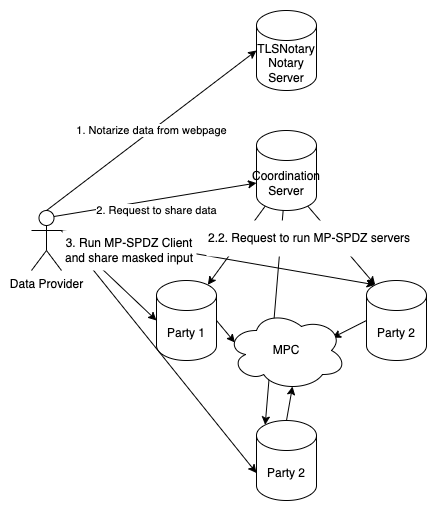
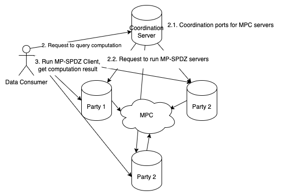

# MPCStats Demo Infrastructure

## 1. Introduction

MPCStats Demo Infrastructure provides a boilerplate for privacy-preserving statistical analysis and developers can use this boilerplate to build their own privacy-preserving applications by modifying existing components or extending functionality. We support use cases with this pattern:

1. Data providers generate a proof for their data from some website using [TLSNotary](https://tlsnotary.org/). This proof does not reveal their data.
2. Arbitrary computation can be performed on all data providers' masked data using MPC (we're using [MP-SPDZ](https://github.com/data61/MP-SPDZ/) as the MPC framework). Computation is defined with Python DSL and support common statistical operations.
3. Data consumers can query the results.

Data consumers can be convinced the statistical results are correct without revealing their data.

The current implementation demonstrates our [Devcon demo](https://demo.mpcstats.org/) where participants collaboratively compute the statistical results from their ETH balance on Binance. This docs explain how everything works, how to modify the boilerplate, and how to deploy the infrastructure.

---

## 2. Architecture Overview

We use a client-server architecture, where there are 3 parties running all the time while data providers and consumers serve clients, i.e. data providers can go offline after providing their data and data consumers can go offline after querying the results.

The core components are:

- **Coordination Server**: provides API for data providers and consumers to interact with, and coordinates computation sessions between computation parties.
  - Verifies TLSNotary proof and prevents Sybil attacks.
  - Implements rate-limiting to prevent DoS attacks.
- **Computation Parties**:
  - Store secret-shared data received from data providers.
  - Perform MPC computations defined in DSL
  - Return results to data consumers.
  - Each party operates independently to ensure security.
- **TLSNotary Server**: data providers prove their data using it.
  - Modified from the original TLSNotary server so the proved data is a commitment instead of plaintext. Later in MPC program, we verify the commitment matches the data provider's data.
- **(Optional) Client API**:
  - It's essentially a data consumer, but it's a REST API service that periodically polls computation parties for results and caches them
  - Provides a simple interface for end users to query statistical results without interacting with the coordination server (and thus triggering MPC computations)

### Workflow

#### Data Proving and Sharing

1. Data providers prove their balance using the Notary Server and obtain a TLSNotary proof.
2. Data providers submit the TLSNotary proof to the Coordination Server, signaling their intent to share data.
3. The Coordination Server instructs computation parties to initiate an MPC session on designated ports and wait for data providers to connect.
4. Data providers run a client to secret-share their balance with the computation parties.
   - Computation parties verify if the secret-shared balance matches the one in the TLSNotary proof. If not, they reject the data provider.

#### Query Computation

1. Data consumers submit a query to the Coordination Server, requesting aggregated statistics.
2. The Coordination Server instructs computation parties to perform MPC on the shared data.
3. Data consumers retrieve the statistical results from the computation parties through the client interface.

### Security Considerations

- Coordination Server:
  - Centralized to streamline coordination but does not access or store plaintext data.
  - Rate-limiting and participant verification reduce the risk of Sybil attacks and DoS.
    - In Binance case, we expose a field "uid" in the TLSNotary proof, which is a unique identifier for each data provider. This way we prevent Sybil attacks by checking if the uid is unique.
- Notary Server:
  - Participants trust the Notary Server to generate a correct proof.
  - By default, we use a local notary whose private keys are exposed, so it's possible for people to forge it. Running a remote notary server can mitigate this risk.
- Computation Parties: Computation parties must be operated by non-colluding entities to prevent reconstruction of participants' balances.

## 3. Deploying the Infrastructure

(To-be-completed)

### Local Deployment

(To-be-completed)

### Remote Deployment

(To-be-completed)

## 4. Customizing the Infrastructure

(To-be-completed)

Developers can modify and extend the boilerplate to create their own privacy-preserving applications.

- Customization Areas:

  1. TLSNotary Integration: Adjust the prover and verifier to handle new data sources.
  2. MPC Program: Modify or extend the statistical computations to fit specific needs.
  3. Database and Storage: Customize how data is stored or integrated into external systems.

- Steps to Customize:

  1. Modify the TLSNotary prover and verifier for new data sources. Can look at a few examples [here](https://github.com/ZKStats/tlsn/tree/mpspdz-compat/tlsn/examples), specifically to be compatible with end-to-end flow, pls follow the instruction [here](https://github.com/ZKStats/tlsn/tree/mpspdz-compat/tlsn/examples/binance)
  2. Update the MPC program to include additional or modified statistical operations. Use MPCStats library for statistical operations. Can see the example and instruction what/how to customize [here](https://github.com/ZKStats/MP-SPDZ/tree/mpcstats-lib/mpcstats)
  3. Customize how data is stored [here](https://github.com/ZKStats/mpc-demo-infra/blob/e73b35aa487b8dc1efd403edddb80f10ebebf681/mpc_demo_infra/coordination_server/database.py#L31) by modifying class MPCSession (Line ), in this example we store eth_address and uid to make sure that same person (aka same binance uid) with corresponding eth_address wont submit multiple proofs.

     Once modify database structure, we also need to modify its correspondong flow which is p obvious [here](https://github.com/ZKStats/mpc-demo-infra/blob/e73b35aa487b8dc1efd403edddb80f10ebebf681/mpc_demo_infra/coordination_server/routes.py#L142-L157) and [here](https://github.com/ZKStats/mpc-demo-infra/blob/e73b35aa487b8dc1efd403edddb80f10ebebf681/mpc_demo_infra/coordination_server/routes.py#L233-L250)

  4. Deploy and test the customized application locally before scaling to a remote setup.

## 5. Technical Details

### Input Authentication

- Data providers prove their Binance balance using TLSNotary.
- During MPC, the balance is used as a private input, and a TLSNotary commitment is calculated and revealed alongside the stats result.
- All parties verify the TLSNotary proof to ensure that the private input matches the commitment, providing input correctness.

### Client Interface

In vanilla MPC, for data consumers to know the results from a computation, all data providers and consumers must stay online all the time, but that's not practical for

- Data Providers: Share masked balances with 3 computation parties via secret sharing. This allows them to go offline after providing their data.
- Computation Parties: Perform MPC to compute the statistical result.
- Data Consumers: Query results from the computation parties, ensuring asynchronous participation.

### Benchmarks

MPC Protocol: Settled on [`mal-rep-ring`](https://mp-spdz.readthedocs.io/en/latest/readme.html#honest-majority), a malicious secure, honest majority protocol, i.e. it tolerates up to 1/3 malicious parties. We benchmarked through all MPC protocols provided by MP-SPDZ and found it's the most practical option for our demo:

- TLSNotary Data Commitment: Identified as a bottleneck operation but performed efficiently, taking roughly 1 second for 1-byte data.
- Mean Calculation: Computes the mean of 10,000 numbers in under 0.2 seconds.

See [here](https://pse-team.notion.site/Choosing-a-Suitable-MPC-Protocol-fffd57e8dd7e8034b4d7c75b02d79ed3) for more details.

### Comparison with Existing Works

#### Framework we use ([ref](https://arxiv.org/pdf/2012.08347))

Types of Data flow

- Message flow: from one party to another
- Service Provider flow: message flow + compute on the message during transit
- Aggregation flow: get messages from multiple parties

Problems with Data

- Copy Problem: Once data is out, we lost control of it to the recipient.
  - [here](https://www.youtube.com/watch?v=gbYXBJOFgeI) is philosophical debate if this problem should be solved or not…
- Bundling Problem: Something cannot be trusted/verified without context of other relevant bits
- Edit Problem: how to be sure that the entity storing data doesn’t edit it before transferring
- Recursive Oversight Problem: who watches the watcher

Framework itself

- Input Privacy: Can process info hidden from you
  - Make sure service providers process data without being able to see it or use it for other purposes outside of the governed info flow.
  - Most tech we know: zkp, mpc, fhe, enclave, …
- Output Privacy: Cannot reverse engineer input from output
  - DP gives limit on the likelihood that can infer input, Especially for preventing linkability of data that is split by categorty: for example: if documents are grouped by authors employer, then stats are calculated across documents, DP can prevent one from knowing info specific to an employer.
- Input Verification: Ensure that the info comes form you
  - public key infra, digital signature, zkp (ability to verify the input to arbitrary computation)
- Output Verification: Ensure the process of calculation is correct
  - Without causing recursive oversight problem
- Flow Governance: Who holds authority to modify the flow
  - mostly MPC

#### Actual comparison with existing works

##### 1.[PySyft](https://github.com/OpenMined/PySyft): PET with [data science](https://ep2024.europython.eu/session/pysyft-data-science-on-data-you-are-not-allowed-to-see/)

**Product**

- **Target Users**: Remote Research! PySyft from Open Mined is non-profit foundation to build the public network for non-public information, mostly geared towards data scientists & researchers that want to operate a certain algorithm over private data.
  - It connects objective-aligned researchers with data owners for research itself!
  - Data Owner wants to collaborate and share their data for researchers in a private way.
- **How to Use**:
  - import syft as sy
  - But can write everything as it Python, and just integrate with sy after each step.
  - So users can toy with it as if its just Python.
- Two sides: data provider and data consumer.
  - Data provider can create corresponding mock data, create account for eligible researchers, then approve the algorithm.
    - Datasites are servers for non-public data that maintain strict control over data access and use. Datasites can be deployed on local computers, in a cluster, or in the cloud. And for more stringent security, Datasites support air-gapped configuration to separate the prototyping environment from code execution.
  - Data consumer can test their algorithm with mock data and request the computation result. All this can be done in Python!
- **What calculations**: support only Python CPU, GPU.

**Technology**

- **Input Privacy**: Running locally or encrypted and transfer to use with enclaves (TEE, confidential container by Microsoft Azure and such as well)
- **Output Privacy**: -
- **Input Verification**: By partnering up with Syft! If using TEE, verify the match between in TEEE and the reference values in the stakeholder datasite itself. https://blog.openmined.org/secure-enclaves-for-ai-evaluation/
- **Output Verification**: Secure enclaves with code attestation from a trusted third-party service (e.g. Microsoft Azure's Remote Attestation Service, NVIDIA Remote Attestation Service). [WIP]
- **Flow Governance**: For multi-party: stakeholders within both firms. For single party, now p scary since we upload original dataset to datasite…..why?
- **Number of Parties**: Mostly one, but if multiple, [still in experiment] will use secure enclave. Syft will orchestrate various approvals necessary from the organizations to allow your computation.

##### 2.[Rosetta](https://github.com/LatticeX-Foundation/Rosetta)

**Product**

- **Target Users**: By https://latticex.foundation/ to develop a large-scale distributed interoperable computational network that supports the expansive economy activities and broader business applications.
  - Accelerator, Research Pioneer, Facilitator
- **How to Use**:
  `import latticex.rosetta as rtt` - Then write tensorflow with it! —> interface is not really that easy, more like mp-spdz
- **What calculations**: Anything written in Tensorflow

**Technology**

- **Input Privacy**: MPC for 3 parties using SecureNN and Helix (both semi-honest model with honest majority)
- **Output Privacy**: -
- **Input Verification:** [-](https://blog.openmined.org/secure-enclaves-for-ai-evaluation/)
- **Output Verification**: Mystique, zkp for secure inference of AI
- **Flow Governance**: by design
- **Number of Parties**: 3

##### 3. Secretflow (Unified framework for privacy-preserving ml & data analysis)

**Product**

- **Target Users**: Try to be one-stop-shop for developers in privacy preserving tech: from poc to production-ready. Claim to be modular enought to support most PETs, and ML framework including PyTorch & JAX
  - Specifically SPU is Domain-specific compiler and runtime suite for ML
- **How to Use**: import spu.utils.distributed as ppd,
  - and then can just write JAX
  - Very nice abstraction of multiparty-computation.
- **What calculations**: All that ML framework supported

**Technology (SPU itself)**

Ironically, not see much on how they bring every tech together or allow for modularity as they claim in website.

- **Input Privacy**: MPC
- **Output Privacy**: -
- **Input Verification**: -
- **Output Verification**: -
- **Flow Governance**: by design
- **Number of Parties**: multiple
- **Paper**: [SPU Paper](https://www.usenix.org/system/files/atc23-ma.pdf).
- **Integration**: Mikerah suggests that if we could translate torch to PPHLO, we could support torch code in MP-SPDZ DSL, with the flow: torch → PPHLO → MP-SPDZ DSL.

##### 4. [Nillion](https://docs.nillion.com/)

**Product**

- **Target Users**: Developer building application at intersection of Blockchain <> Data (mostly AI)
- **How to Use**:
  - Need to write program using Nada Language, and deploy it similar to other blockchains.
- **What calculations**: Anything written in their own language (Nada)

**Technology**

- **Input Privacy**: MPC: use 2 phases: interactive pre-processing phase (not depend on input) and non-interactive computing phase
- **Output Privacy**: Just by MPC, not seeing DP yet
- **Input Verification**: Similar to blockchain, so yes tied to your Nillion wallet address
- **Output Verification**: Yes, its on network itself
- **Flow Governance**: by design
- **Number of Parties**: multiple
- **Paper**: https://nillion.pub/sum-of-products-lsss-non-interactive.pdf
- Note: This is not the same as client interface! Because this still requires all computation parties to be online at the same time in pre-processing phase. And in this example, there is no concept of client, since the party is involved in MPC operation itself. However, we can literally integrate client interface with this protocol.
- Note2: Information-theoretic security is a bit different than typical encryption, because it has no adversarial computational assumption. However, this is all still be pointless if some threshold of parties are corrupted (based on mpc security) similar to all MPCs anyway.

## 6. Potential Enhancements

- Enhance verifiability using Trusted Execution Environments (TEE) or collaborative SNARKs.
- Explore integration with Fully Homomorphic Encryption (FHE) for asynchronous workflows.
